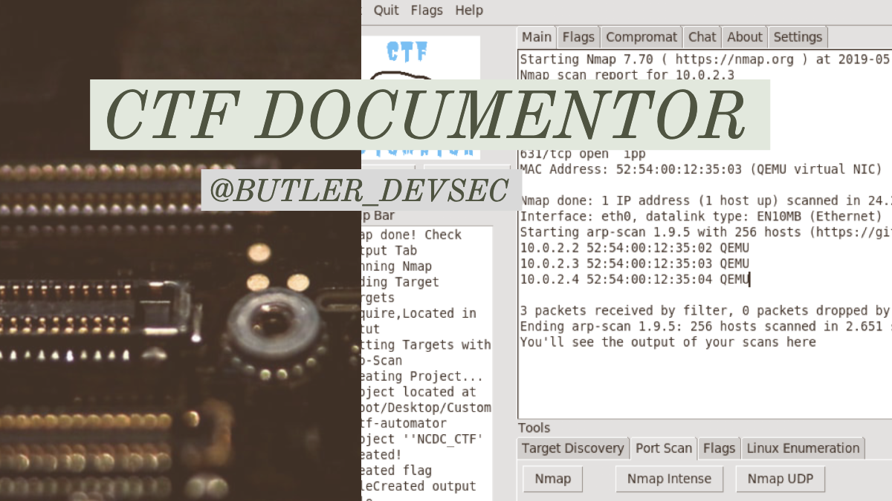

# CTF Documentor 

The CTF Documentor is a GUI python application designed to better facilitate the documentation that often accompanies CTF boot to root competitions. It combines two essential functionalities; running common enumeration and vulnerability scans natively in the application, and automatically documenting and displaying those scans.

# Index
- [CTF Documentor](#ctf-documentor)
- [Index](#index)
  - [Overview](#overview)
  - [Getting Started](#getting-started)
  - [System Requirements](#system-requirements)
  - [Installation](#installation)
  - [Running for the First Time](#running-for-the-first-time)
  - [Use](#use)
    - [Creating a Project:](#creating-a-project)
    - [Adding A Target to Scope](#adding-a-target-to-scope)
    - [Enumeration](#enumeration)
  - [Dev Roadmap](#dev-roadmap)
  - [Contributing](#contributing)

## Overview
The CTF Documentor was designed and built for Kali Linux. All enumeration and vulnerability scanning tools built into the application are pre-installed in the Kali Linux Distro by default. Some additional tools can be git cloned while inside the application, namely my ctf-playbook markdown artifact. 

## Getting Started
CTF Documentor was built and intended to be used on the latest version of Kali Linux for virtualbox. At the time of this release you can download this image [here](https://www.offensive-security.com/kali-linux-vm-vmware-virtualbox-image-download/). While the application might work in other pentesting-specefic enviorments like Parrot Security, multi-OS is out of scope for the current release. Future releases might include OS handling.

## System Requirements

1) Kali Linux for Virtual Box and the following programs  
    -    Nmap
    -    Dirb
    -    arp-scan
    -    sparta
    -    netdiscover
    -    python 2.7 + (There will need to be major changes made prior to python 2's deprecation)
    -    Python module tkinter

## Installation
To get started, launch your kali linux machine in Virtualbox. Make sure to give your machine an internet connection by enabling the NAT adaptor and having internet conmnection to your local machine. 

In the terminal of your linux machine change directories to your desktop by entering,

        cd Desktop

Then, clone the repository to your desktop with the command,

        git clone https://github.com/tcbutler320/CTF-Documentor

## Running for the First Time
To open and run the application, navigate inside the directory with the terminal command 

        cd CTF-Documentor 

Run the program with 

        python ./automator-gui.py

The program is up and running properly if you are greeted with this home dashboard 

Currently, you must use the "create project" function every time you'd like to use the CTF Documentor. Importing an existing project, or using scans without having creating a project is not supported. These features will be added in later releases. 

Home Dashboard: 

## Use
Before launching enumeration or vulnerability scans,you first must create a project using the new project button. As a general reminder, any pop-up boxes must be closed manually. 

### Creating a Project: 

After creating a project, you will need to add a target to the project scope in order to conduct any scanning. There are two ways to do this. Navigate over to the target discvory tab on the tools bar in the bottom of the dashboard. Using the arp-scan button will search your connected network for IP's found in address resolution protocol communications. You can add one of these IP's to the project scope by navigating to the port scan tab, and entering the ip into the feild below and clicking set target

### Adding A Target to Scope

Adding a Target to Scope: 

With a target set, you are now able to use the pre-set enuneration buttons for a variety of scans. Nmap, Nmap Intense, and Nmap UDP are pre-defined nmap scans which can be activated by presses the button.

### Enumeration 
With a target selected, you can now use the enumeration functions. To run a scan, simply navigate between the tool tabs at the bottom of the dashboard. There are several tabs, with more being added in later releases. 

__Current Tool Tabs__
+ Target Discovery: Scan the network to find a target
+ Port Scan: Enumerate services on the target
+ Flags : Enter discovered flags to your documentation
+ Linux Enumeration : Linux specific bash scripts 

## Dev Roadmap
CTF Documentor is being rapidly developed in an ad-hoc manner. It's primary purpose was to be built as a learning tool. There are several features being planed. Below is a short list of features to be implemented. If you are interested in contributing, please see the contributing guidelines or reach out to me on twitter @butler_devsec

__Future Features__
+  __Enumeration__
    -    Nmap NSE engine scans
    -    Searchsploit functionality 
+  __Teams__
    -    Use ncat as a chat server: Allow multiple CTF Documentor users to chat with one another by using simple ncat chat servers
    -    Share documentation with one another via ftp or a simple web server
+  __Weaponization__
    -    Hydra brute force 
    -    nc or ncat for sending reverse shells 

And much more!

## Contributing 
If your interested in contributing to the project, feel free to do so on your on terms. You may reach out on twitter or other platforms for questions or ideas for enhancements.